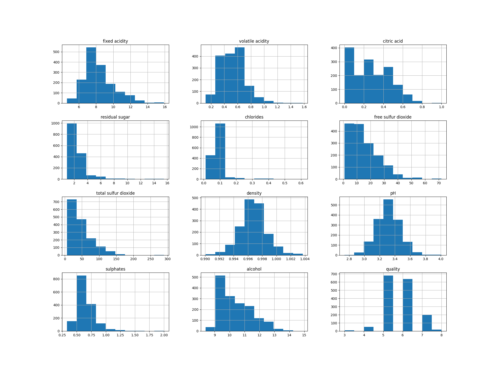
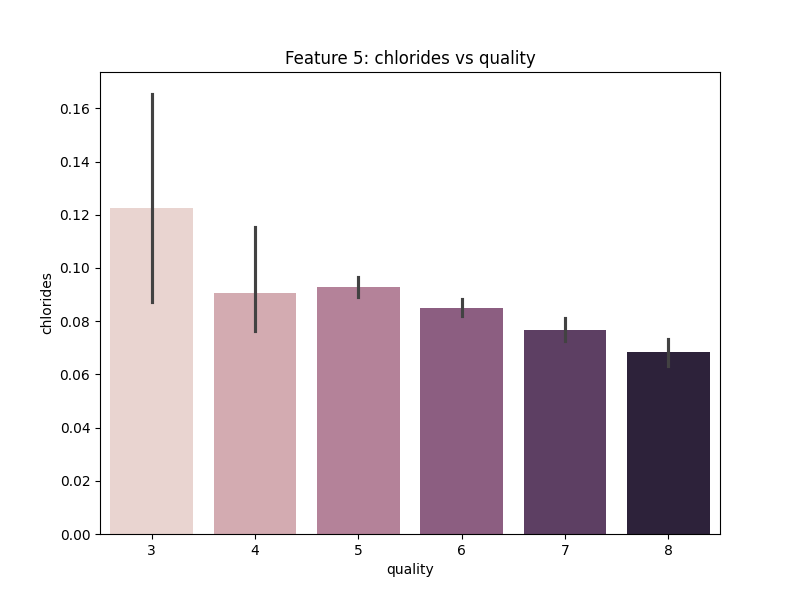
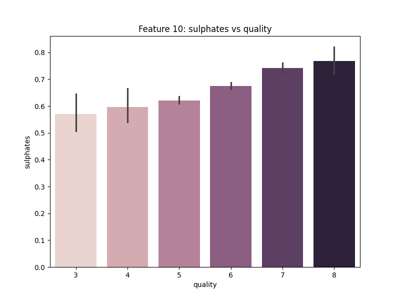
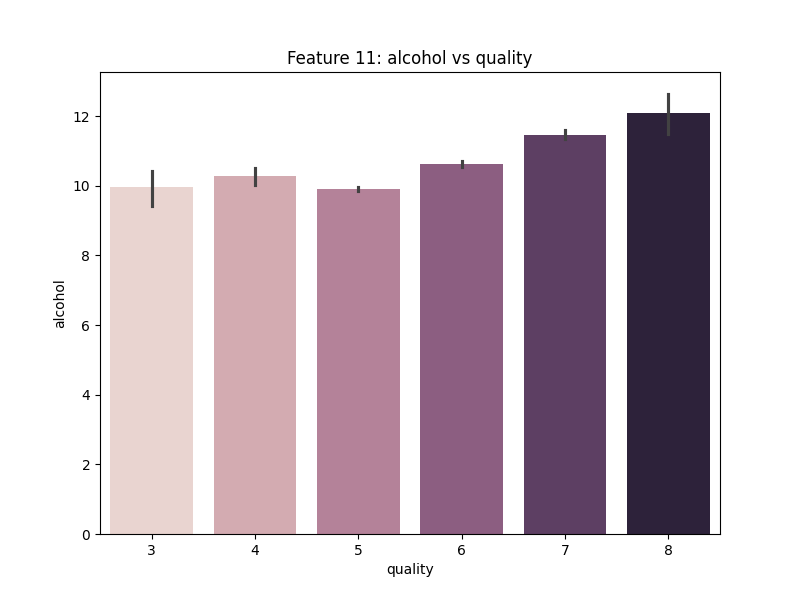
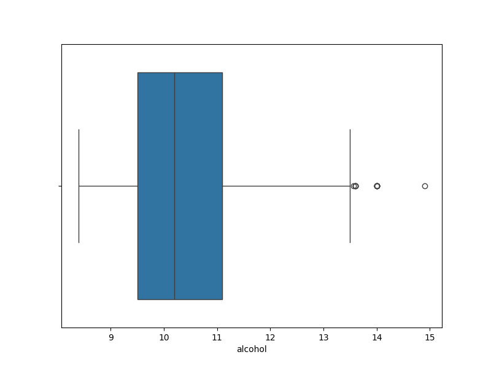
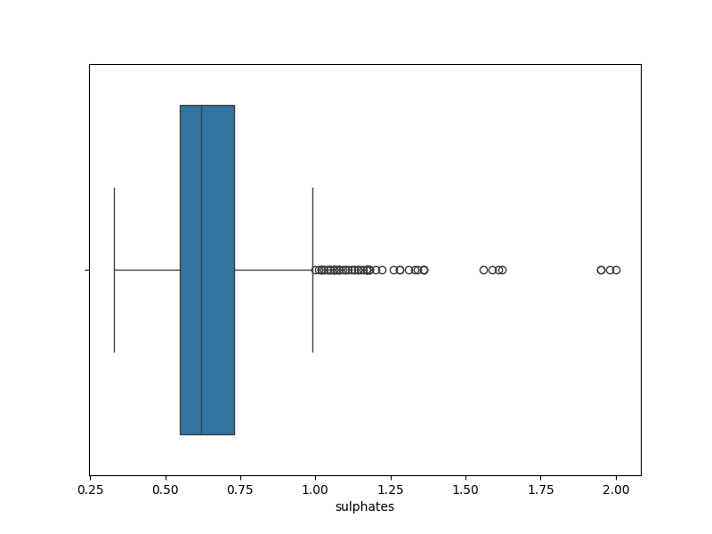
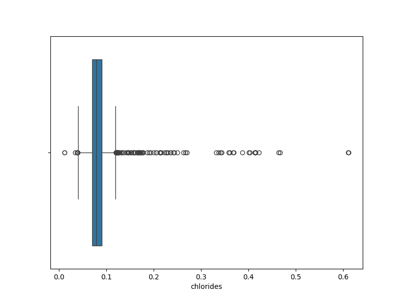
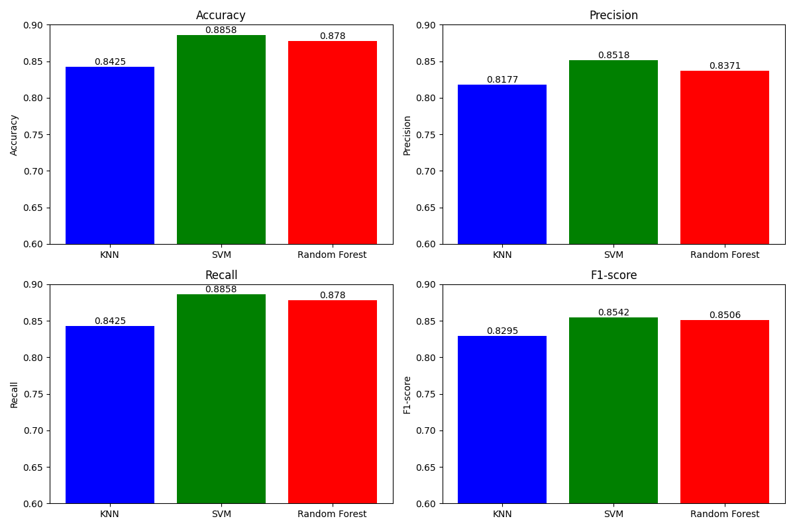

# Laporan Proyek Machine Learning - Putu Widyantara Artanta Wibawa

> [!IMPORTANT]
> This Markdown file is optimized for use with the GitHub. However, certain content such as equations or citations may not display or function correctly on other platforms.

## Domain Proyek


*Source: UCI Machine Learning*

Domain yang dipilih dalam proyek ini adalah **Ekonomi dan Bisnis**, dengan judul proyek **Predictive Analytics: Red Wine Quality Classification**.

Red wine merupakan minuman beralkohol yang terbuat dari anggur merah. Wine sudah sangat populer untuk dikonsumsi secara global dan konsumsi wine dalam jumlah tertentu juga memberikan manfaat 
kesehatan [^1]. Saat ini, beredar berbagaim macam jenis red wine dengan kandungan yang berbeda-beda. Untuk dapat mengkategorikan kualitas red wine dalam jumlah yang banyak secara cepat dan efisien, diperlukan sebuah pendekatan berbasis machine learning.

Salah satu keunggulan utama dari pendekatan machine learning adalah kemampuannya untuk memproses dan menganalisis volume data yang besar dan beragam dengan kecepatan yang tinggi. Dengan memanfaatkan machine learning, diharapkan akan mampu mengidentifikasi pola yang rumit dan hubungan antar fitur dari bahan-bahan red wine yang mungkin tidak terlihat oleh metode analisis secara manual atau tradisional.

Beberapa penelitian terdahulu telah melakukan klasifikasi wine menggunakan machine learning, salah satunya menggunakan metode SVM, Naive Bayes, dan Random Forest [^2]. Penelitian lainnya juga menggunakan metode Random Forest [^3]. Pada proyek ini akan dilakukan klasifikasi kualitas red wine menggunakan perbandingan metode KNN, SVM, dan Random Forest.

## Business Understanding

### Problem Statements

Berdasarkan latar belakang di atas, adapun rumusan masalah dalam proyek ini adalah:
- Bagaimana tahapan pemrosesan data dalam mengambangkan model machine learning untuk melakukan klasifikasi terhadap kualitas red wine?
- Bagaimana mengembangkan model machine learning dengan metode KNN, SVM, dan Random Forest dalam melakukan klasifikasi terhadap kualitas red wine?
- Model apakah yang menghasilkan performa terbaik (dengan metrics accuracy, precision, recall, dan F1) dalam melakukan klasifikasi terhadap kualitas red wine?

### Goals

Menjelaskan tujuan dari pernyataan masalah:
- Untuk mengetahui tahapan pemrosesan data dalam mengambangkan model machine learning untuk melakukan klasifikasi terhadap kualitas red wine
- Untuk mengetahui cara mengembangkan model machine learning dengan metode KNN, SVM, dan Random Forest dalam melakukan klasifikasi terhadap kualitas red wine
- Untuk mengetahui model yang memiliki performa terbaik (dengan metrics accuracy, precision, recall, dan F1) dalam melakukan klasifikasi terhadap kualitas red wine

## Data Understanding

Dataset yang digunakan dalam proyek ini adalah [Red Wine Quality](https://www.kaggle.com/datasets/uciml/red-wine-quality-cortez-et-al-2009) yang disediakan oleh UCI Machine Learning pada platform Kaggle.

### Variabel-variabel pada Red Wine Quality dataset adalah sebagai berikut:

Dataset tersebut terdiri atas 1599 data dengan 12 fitur (termasuk 1 fitur target). Adapun penjelasan dari fitur-fitur tersebut adalah:

1. **Fixed Acidity**: Konsentrasi asam tartarat dalam anggur, diukur dalam gram per liter.

2. **Volatile Acidity**: Konsentrasi asam asetat dalam anggur, diukur dalam gram per liter.

3. **Citric Acid**: Konsentrasi asam sitrat dalam anggur, diukur dalam gram per liter.

4. **Residual Sugar**: Jumlah gula yang tersisa setelah fermentasi selesai, diukur dalam gram per liter.

5. **Chlorides**: Konsentrasi garam dalam anggur, diukur dalam gram per liter.
 
6. **Free Sulfur Dioxide**: Jumlah SO2 bebas yang hadir dalam anggur, diukur dalam miligram per liter.

7. **Total Sulfur Dioxide**: Jumlah total SO2 dalam anggur, termasuk bentuk bebas dan terikat, diukur dalam miligram per liter.

8. **Density**: Massa per volume dari anggur, diukur dalam gram per mililiter. 

9. **pH**: Ukuran tingkat keasaman atau kebasaan dalam anggur. Skala pH berkisar dari 0 (sangat asam) hingga 14 (sangat basa), dengan 7 menunjukkan keadaan netral.

10. **Sulphates**: Konsentrasi garam sulfat dalam anggur, diukur dalam gram per liter.

11. **Alcohol**: Persentase volume alkohol dalam anggur. Kadar alkohol memengaruhi sensasi panas dan keseimbangan rasa dalam anggur.

Target fitur:

12. **Quality**: kualitas red wine dalam rentang 0 sampai 10.

### Data Visualization & EDA

- Melakukan visualisasi distribusi dari setiap fitur, untuk mengetahui distribusi dari fitur-fitur yang ada.



-  Melakukan visualisasi dan analisis terhadap pengaruh setiap variabel terhadap kualitas red wine. Ilustrasi dan penjelasan lengkap dapat dilihat pada [notebook](notebook.ipynb). Beberapa contoh ilustrasi:





-  Melakukan visualisasi dan analisis terhadap outlier dari setiap variabel.





-  Melakukan visualisasi dan analisis heatmap dari data untuk mengetahui korelasi antar fitur.
  


## Data Preparation
Adapun proses data preparation yang telah dilakukan yaitu:

1. Menghilangkan nilai yang duplikat pada dataset. Tahapan ini diperlukan untuk mengurangi bias dan mencegah overfitting dari model.
2. Menghilangkan outlier pada fitur-fitur penting seperti `alcohol`, `sulphates`, `citric acid`, dan `volatile acidity`. Outlier akan berpengaruh terhadap penurunan performa model, sehingga dapat menghasilkan prediksi yang kurang akurat dan harus dihilangkan.
3. Melakukan konversi fitur target dari rentang 0-10 menjadi data kategorikal yaitu `bad`, `medium`, dan `good`, dan kemudian di encode kembali. Tahapan ini dilakukan karena tujuan dari proyek ini adalah melakukan klasifikasi multi-kelas dengan 3 kelas dan agar lebih mudah dalam menggeneralisasi kualitas red wine.
4. Melakukan split untuk data testing (20%) dan data training (80%). Tahapan ini diperlukan untuk menyediakan data latih kepada model dan proporsi data testing sekitar 20% karena total data berjumlah 1268 sehingga diperlukan data testing dengan persentase yang cukup. 
5. Melakukan normalisasi dan transformasi data training dengan Standard Scaler. Transformasi ini bertujuan agar setiap fitur memiliki skala yang sama dan juga penting bagi beberapa model ML seperti KNN dan SVM.

## Modeling

Dalam tahap modeling, terdapat 3 metode model ML yang digunakan, yaitu K-Nearest Neighbors (KNN), Support Vector Machine (SVM), dan Random Forest. Adapun parameter yang digunakan adalah hyperparameter bawaan dari scikit-learn.

Adapun kelebihan dan kekurangan dari setiap algoritma atau metode tersebut adalah:
1. **KNN**
   - Kelebihan: Memiliki implementasi yang sederhana dan mudah dimengerti, selain itu juga cukup robust terhadap noise dan outlier pada data.
   - Kekurangan: Memiliki waktu komputasi yang cukup lama dan lemah terhadap data dengan dimensi tinggi, selain itu juga sensitif terhadap fitur yang kurang relevan karena hanya bergantung pada jarak.
2. **SVM**
   - Kelebihan: Memiliki efisiensi yang baik terhadap data dengan dimensi tinggi. Memiliki kernel yang dapat digunakan untuk berbagai keperluan data dan cukup robust terhadap overfitting pada data dengan dimensi tinggi.
    - Kekurangan: Memiliki waktu komputasi dan penggunaan memori yang besar pada dataset yang sangat besar, selain itu tuning hyperparameter untuk C (regularization parameter) cukup memakan waktu.
3. **Random Forest**
   - Kelebihan: Cukup robust karena pada dasarnya terdiri dari kombinasi decision tree, selain itu juga mampu menangani fitur dengan missing value dan dapat digunakan baik untuk klasifikasi maupun regresi.
   - Kekurangan: Membutuhkan lebih banyak memori untuk komputasi dibandingkan decision tree, selain itu juga sulit untuk menangani dataset dengan kelas yang tidak seimbang.
  

Berdasarkan ketiga model tersebut, model yang paling baik untuk dipilih adalah SVM, mengingat SVM bersifat robust atau handal, dan cukup cepat terhadap data yang tidak terlalu banyak, serta tetap mampu mempertahankan performa dalam data pada dimensi tinggi.

## Evaluation

Dalam tahap evaluasi, metrik yang digunakan adalah `accuracy`, `precision`, `recall`, dan `F1-score`. 

Adapun cara untuk menghitung atau mendapatkan setiap metriks tersebut adalah sebagai berikut:

1. **Accuracy** didapatkan dengan menghitung persentase dari jumlah prediksi yang benar dibagi dengan jumlah seluruh prediksi. Formula:

```math
\text{Accuracy} = \frac{\text{TP + TN}}{\text{TN + TP + FN + FP}} \times 100\%
```

2. **Precision** didapatkan dengan menghitung persentase dari jumlah prediksi benar positif dari keseluruhan hasil yang diprediksi positif. Formula:

```math
\text{Precision} = \frac{\text{TP}}{\text{TP} + \text{FP}}
```

3. **Recall** didapatkan dengan menghitung persentase dari jumlah prediksi benar positif dibandingkan dengan keseluruhan data yang benar positif. Formula:

```math
\text{Recall} = \frac{\text{TP}}{\text{TP} + \text{FN}}
```

4. **F1-Score** didapatkan dengan menghitung perbandingan antara rata-rata precision dan recall yang dibobotkan. Formula:

```math
\text{F1 Score} = 2 \times \frac{\text{Precision} \times \text{Recall}}{\text{Precision} + \text{Recall}}
```

Berdasarkan hasil pengujian terhadap data testing, didapatkan hasil sebagai berikut:



Adapun model KNN mendapatkan hasil accuracy, precision, recall, dan F1-score secara berturut-turut adalah 84.25%, 81.77%, 84.25%, dan 82.95%. Sementara SVM mendapatkan hasil accuracy, precision, recall, dan F1-score secara berturut-turut adalah 88.58%, 85.18%, 88.58%, dan 85.42%. Sedangkan Random Forest mendapatkan  hasil accuracy, precision, recall, dan F1-score secara berturut-turut adalah 87.8%, 83.71%, 87.8%, dan 85.06%. 

Dapat disimpulkan bahwa model dengan performa terbaik disemua metriks yang diberikan adalah **SVM (Support Vector Machine)**.

## References

[^1]: Snopek L, Mlcek J, Sochorova L, Baron M, Hlavacova I, Jurikova T, Kizek R, Sedlackova E, Sochor J. Contribution of red wine consumption to human health protection. Molecules. 2018 Jul 11;23(7):1684.

[^2]: Kumar S, Agrawal K, Mandan N. Red wine quality prediction using machine learning techniques. In2020 International Conference on Computer Communication and Informatics (ICCCI) 2020 Jan 22 (pp. 1-6). IEEE.

[^3]: Aich S, Al-Absi AA, Hui KL, Lee JT, Sain M. A classification approach with different feature sets to predict the quality of different types of wine using machine learning techniques. In2018 20th International conference on advanced communication technology (ICACT) 2018 Feb 11 (pp. 139-143). IEEE.